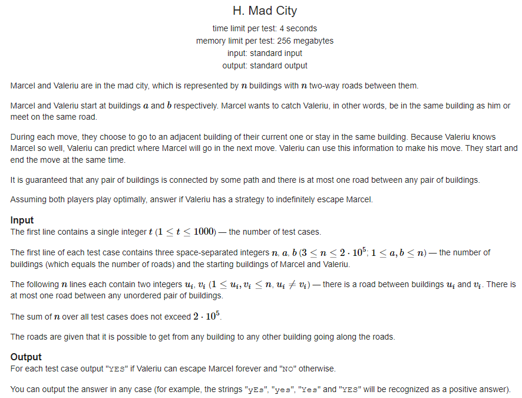

# Exercicios Codeforces

**Número da Lista**: X 
**Conteúdo da Disciplina**: Grafos 1 

## Alunos
|Matrícula | Aluno |
| -- | -- |
| 19/58587  |  Matheus Oliveira |

## Sobre 
Faz-se o uso dos algoritmos aprendidos em sala, para explicar a resolução de problemas de grafos do Codeforces.

## Screenshots

## Instalação 
**Linguagem**: C++ 
Compilador GCC 17+

## Uso 
Explique como usar seu projeto caso haja algum passo a passo após o comando de execução.

## Outros 
Quaisquer outras informações sobre seu projeto podem ser descritas abaixo.

